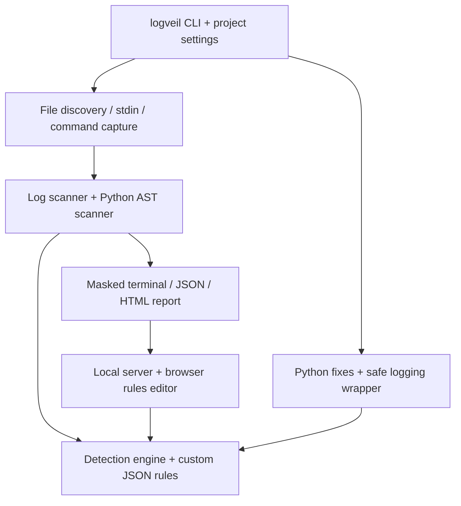

# logVeil

A local sensitive-data scanner for **logs from any language, command output, and Python logging calls**. Review masked findings in your terminal or browser, define your own patterns, and use exit codes to gate CI jobs.

## Background

Financial applications handle confidential customer information that can accidentally reach logs through debugging statements, whole objects or exception messages. Developers need a convenient way to check real application output during daily development. logVeil runs locally, without an API key, cloud service or production database connection.

## Get the local command

Requires **Python 3.10+**. Build a standalone command from this repository without pip or downloads:

```sh
python3 scripts/build_standalone.py
./dist/logveil --help

# Add this build to PATH for the current terminal
export PATH="$PWD/dist:$PATH"
```

You can now change to any project directory and run `logveil`. The archive contains the scanner, report generator and rules editor; it needs only Python on the host. Rebuild after changing source code. On Windows, invoke the archive as `python path/to/dist/logveil`.

Alternatively, install the Python package (also needed in applications using automatic Python repairs):

```sh
python3 -m venv .venv
source .venv/bin/activate
python -m pip install .
logveil --help
```

Keep this environment active when changing directories. Installation uses setuptools; the scanner itself has no third-party runtime dependencies. From the source checkout, `python3 -m pii_guard` works too. `pii-guard` remains an installed compatibility alias.

## Scan your logs

```sh
# Recursively scan a log directory
logveil scan ./logs --html scan-results.html

# Scan specific files, including compressed logs
logveil scan application.log audit.jsonl archived.log.gz --json

# Scan Python source and captured logs together
logveil scan ./src --logs ./logs --html scan-results.html

# Read logs from stdin
cat application.log | logveil scan -
```

No example service or mock data is needed. Point the scanner at the files your application actually produces.

Directories discover `.py`, `.log`, rotated `.log.1`, `.jsonl`, `.ndjson`, `.json`, `.txt`, `.out`, `.err`, and compressed log equivalents ending in `.gz`. Explicit file paths can have any extension. Use `--mode logs` to scan only discovered log/text files, or `--mode python` for Python source analysis. `.json` files are parsed as JSON documents; use `.jsonl`/`.ndjson` for one record per line.

## Check an application or test run

```sh
logveil run --html scan-results.html -- python app.py
logveil run --html scan-results.html -- npm test
logveil run --timeout 600 --json -- go test ./...
```

logVeil executes the command and scans **stdout and stderr**, without echoing or saving raw output. Put scanner options before `--`. Findings refer to the relevant output stream unless the application supplies source metadata. Files written directly by the application require a separate `scan`.

This mode is for noninteractive commands; stdin is closed and no terminal is allocated. The default timeout is 300 seconds. Shell syntax is not interpreted—use an explicit shell command only when you intend to execute one. The child command runs with your normal permissions and can have its normal side effects.

## Save project settings

Inside the project you want to scan:

```sh
logveil init
```

This creates `logveil.json` and `logveil-rules.json` without overwriting existing files. Edit the paths for your project:

```json
{
  "version": 1,
  "paths": ["src", "logs"],
  "mode": "auto",
  "exclude": ["tests/*", "*.debug.log"],
  "rules": "logveil-rules.json",
  "html": ".logveil/report.html"
}
```

Then use:

```sh
logveil scan
logveil serve
```

Settings load from `logveil.json` in the current directory, or from `--config /path/to/logveil.json`. Configured paths resolve beside that file. Explicit input paths replace configured inputs; `--exclude` adds to configured exclusions. The initial configuration scans `.` and excludes `tests/*`.

## Review results in the browser

With project settings, `logveil serve` hosts the configured report. Without settings, specify a generated file:

```sh
logveil serve scan-results.html --rules /path/to/custom-rules.json
```

- **Results:** [http://localhost:8000/](http://localhost:8000/)
- **Rules editor:** [http://localhost:8000/rules](http://localhost:8000/rules)

The CLI prints clickable links. Use `--port 8080` if needed; press Ctrl+C to stop. The server binds only to loopback. It displays reports and edits the selected existing rules file; it does not execute scans. Run the scan again and refresh to update results. Reports also open directly as offline HTML files.

## Add patterns and apply fixes

Built-in rules detect **emails, Malaysian IC formats, Luhn-valid card candidates and contextual account numbers**. Add your own rule in the browser or edit the rules file:

```json
{
  "version": 1,
  "rules": [
    {"kind": "EMPLOYEE_ID", "pattern": "\\bEMP-[0-9]{6}\\b"}
  ]
}
```

After saving, scan with `--rules custom-rules.json` or the configured project rules. The matched value is shown as `[EMPLOYEE_ID REDACTED]`.

Python-only repair support is still available:

```sh
logveil fix path/to/service.py
logveil fix path/to/service.py --apply
```

Review the preview before applying. Repaired code imports `pii_guard.runtime`, so install logVeil in that application's Python environment. To use custom rules at runtime, set:

```sh
export LOGVEIL_RULES="/absolute/path/to/custom-rules.json"
```

The application must restart after changing cached rules. CLI project settings do not automatically configure a separate application. `PII_GUARD_RULES` remains supported for compatibility.

## Technical architecture



## CI exit codes

| Code | Meaning |
| --- | --- |
| `0` | Scan completed with no unbaselined findings; wrapped command succeeded |
| `1` | Scan completed with findings |
| `2` | Invalid input, unreadable files, timeout or incomplete scan |
| `3` | Wrapped command failed; its original exit code is included in the report |
| `130` | Interrupted |

A failed wrapped command takes precedence over findings. Optional baselines suppress known location/type fingerprints; see the [CI reference](docs/reference.md#ci-baselines).

## Coverage and limits

“Universal” here means **language-independent log and process-output scanning**. Source-code analysis and automatic fixes currently support selected Python logging calls. Other languages need their own source-analysis integrations.

Reports state how many files, streams and log lines were scanned. Empty file selection, invalid UTF-8, binary inputs and input limits fail rather than producing a successful scan. A supplied empty log file or silent successful command may legitimately contain no matches.

Source locations require supported structured metadata. Static findings are heuristic risks; runtime findings are observed patterns. A clean result does not prove that every sensitive value or execution path is covered. Custom regexes are trusted configuration and have no matching timeout. Original input files are not redacted or changed by a scan.

For supported formats, exclusions, source tracing, configuration precedence and rule fields, see the [technical reference](docs/reference.md).

## Tests

```sh
python3 -m unittest discover -s tests -v
```

The banking example exists only under `tests/fixtures` for regression testing. The application has no mock demo command.
