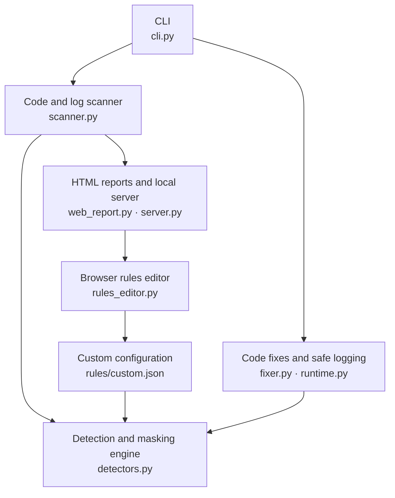

# logVeil

logVeil helps developers detect sensitive data in code and logs, review masked findings, apply masking fixes, and verify the results through a local web interface.

## Background

Financial-industry developers handle confidential customer information, including identity numbers, account details and payment card numbers. That data needs protection in application logs as well as databases.

A debugging statement that logs a customer object or exception can accidentally expose sensitive information. Developers need a simple, convenient tool that fits their daily workflow. logVeil brings detection, source locations, masking fixes and verification into one local tool.

## Quick start

**Requirements:** Python 3.10+, no external dependencies or API key. Run these commands from this repository:

```sh
# Run the demo and generate a before/after report
python3 -m pii_guard demo --html scan-results.html

# Start the local report and rules editor
python3 -m pii_guard serve scan-results.html --rules rules/custom.json
```

- **Results:** [http://localhost:8000/](http://localhost:8000/)
- **Custom rules:** [http://localhost:8000/rules](http://localhost:8000/rules)

The CLI prints clickable links. Keep the server running while using the pages; press **Ctrl+C** to stop. If port 8000 is occupied, add `--port 8080` and use that port in the URLs.

The demo runs a synthetic banking service with direct-field, whole-object and exception-message leaks. It fixes a temporary copy and verifies a fresh run:

```text
Leaking statements: 3 → 0
Detected PII values: 7 → 0
Service results unchanged: True
```

The original example remains unchanged. The report preserves masked findings, but the demo's temporary files are removed after execution.

## Technical architecture



The **scanner** checks Python logging calls and captured logs. The **detection engine** supplies shared pattern matching and masking. The **repair components** wrap supported logging calls so sensitive matches are masked before emission. The **web components** display results and let developers update custom rules.

Everything runs locally using Python's standard library. The product is named **logVeil**; its Python module remains `pii_guard`. IBM Bob can run and review this workflow through its terminal; no Bob API is required.

## Scan your project

Replace the paths below with your Python project and captured test-run logs:

```sh
python3 -m pii_guard scan path/to/project --logs test-run.jsonl --html scan-results.html
```

Use a source path for code scanning, `--logs` for runtime scanning, or both. Add `--json` for machine-readable output. The webpage shows data types, masked evidence, source locations, suggested fixes, and search/filter controls.

The server displays the generated report; it does not run scans. Generate the HTML again and refresh the page to update results. You can also open the HTML file directly without a server.

## Review, fix and verify

```sh
# Preview masking changes
python3 -m pii_guard fix path/to/service.py

# Apply the changes
python3 -m pii_guard fix path/to/service.py --apply

# Rerun your application/tests, then scan the fresh logs
python3 -m pii_guard scan path/to/service.py --logs fresh-test-run.jsonl --html scan-results.html
```

Repairs use `pii_guard.runtime.safe_log`, so keep this package importable in the application environment. Fixes modify supported logging calls; preview the diff before applying. Existing logs are not rewritten.

## Add custom detection rules

Built-in detectors cover **emails, Malaysian IC numbers, Luhn-valid card candidates, and contextual account numbers**. Add other formats without changing Python code:

1. Open the **Custom rules** page.
2. Add a pattern, or edit/remove entries in the JSON draft.
3. Click **Validate draft**, then **Save rules**.
4. Rerun the scan with the saved configuration:

```sh
python3 -m pii_guard scan path/to/project --logs test-run.jsonl --rules rules/custom.json --html scan-results.html
```

You can also edit [rules/custom.json](rules/custom.json) directly. For example:

```json
{
  "version": 1,
  "rules": [
    {"kind": "EMPLOYEE_ID", "pattern": "\\bEMP-[0-9]{6}\\b"}
  ]
}
```

This masks `EMP-123456` as `[EMPLOYEE_ID REDACTED]`. New types automatically appear in report filters. Built-in rules stay enabled.

**For repaired applications to use custom masking**, set the same configuration before launching the application or tests:

```sh
export PII_GUARD_RULES="$PWD/rules/custom.json"
```

`--rules` applies only to that CLI invocation; repairs do not embed the rules. Restart applications after changing their cached rule configuration. See the [rule field reference](docs/reference.md#add-your-own-detection-patterns) for capture groups, masking options and priorities.

## What the results mean

- **Static risks** are heuristic warnings about logging calls; they need review.
- **Runtime findings** are patterns observed in the supplied logs.
- **Source tracing** uses structured log metadata. Plain logs without it show an unknown source. See [logging setup](docs/reference.md#trace-actual-test-run-logs).
- **A clean rerun** means no configured patterns matched the exercised logs; it does not prove that all sensitive data is absent.

Supported code analysis is limited to standard severity calls on `logger`, `logging` and `log`. Custom logging APIs, arbitrary data flows and structured `extra` field masking need additional handling. See [detection scope](docs/reference.md#detection-scope).

## CI and tests

Scan exit codes are **0** for no new findings, **1** for findings, and **2** for invalid input. Optional baselines let CI report only new locations/types; see the [CI guide](docs/reference.md#ci-block-newly-observed-findings).

```sh
python3 -m unittest discover -s tests -v
```

The [technical reference](docs/reference.md) contains the full manual demo, logging setup, rule configuration, CI workflow and implementation limits.
