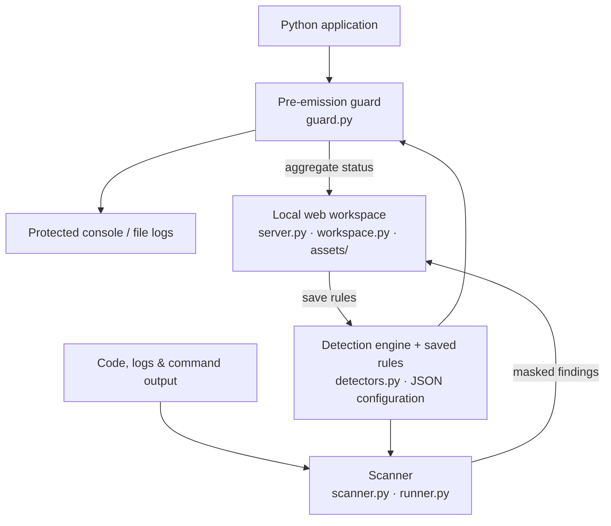

# logVeil

A local privacy workspace to **prevent matched data from reaching protected Python log outputs**, scan logs from any language, and manage detection rules. Use the browser for daily work or the CLI for automation.

## Background

Financial applications handle confidential customer information that can accidentally reach logs through debugging statements, whole objects or exception messages. Developers need a convenient way to check real application output during daily development. logVeil runs locally, without an API key, cloud service or production database connection.

## Technical architecture



The **guard** masks or blocks matches before supported Python text handlers write them. The **scanner** inspects code and existing output. Both use the same detection engine and rules. The **web workspace** runs local scans, displays findings and guard status, and edits rules; it does not need a cloud service.

## Get the local command

Requires **Python 3.10+**. Build a standalone command from this repository without pip or downloads:

```sh
python3 scripts/build_standalone.py
./dist/logveil --help

# Add this build to PATH for the current terminal
export PATH="$PWD/dist:$PATH"
```

You can now change to any project directory and run `logveil`. The archive contains the scanner, report generator and rules editor; it needs only Python on the host. Rebuild after changing source code. On Windows, invoke the archive as `python path/to/dist/logveil`.

Alternatively, install the Python package (also needed in applications using automatic Python repairs):

```sh
python3 -m venv .venv
source .venv/bin/activate
python -m pip install .
logveil --help
```

Keep this environment active when changing directories. Installation uses setuptools; the scanner itself has no third-party runtime dependencies. From the source checkout, `python3 -m pii_guard` works too. `pii-guard` remains an installed compatibility alias.

## Start the local UI

From this repository, run:

```sh
python3 -m pii_guard serve scan-results.html --rules rules/custom.json --port 8003
```

Open **[http://localhost:8003/](http://localhost:8003/)**. Keep the terminal running while you use the UI; press **Ctrl+C** to stop. A previous scan is not required. If the port is occupied, choose another with `--port` and open the matching URL.

To work on another project with the installed or standalone command:

```sh
logveil serve --root /path/to/your/project --port 8003
```

Browser scans stay inside the selected workspace root. Use `--rules PATH` to choose a rule file; otherwise an empty `logveil-rules.json` is created in that workspace. The server listens only on your local machine.

## How to use the UI

### 1. Scan and review findings

1. Open **Scan results** in the sidebar.
2. Enter a file or directory relative to the displayed workspace, such as `logs/` or `src/`.
3. Choose **Code & logs**, **Logs only**, or **Python code**, then click **Run scan**.
4. Review the observed matches, code risks and files scanned. Search by file or data type, or use the type filter.
5. Click a finding to see its masked evidence, location, trace and suggested next step.
6. Click **Export report** to download the HTML report.

Results update when the scan finishes. If a scan fails, the UI shows the failure and retains the previous completed results. A log finding is an observed pattern; a code risk needs review. No matches means only that the inspected inputs did not match the configured patterns.

### 2. Manage and test rules

1. Open **Detection rules** and click **Add rule**.
2. Enter a name such as `EMPLOYEE_ID` and a pattern such as `EMP-[0-9]{6}`. Leave **Keep last characters** at **None** for full masking.
3. Click **Add to draft**. Use **Edit** or **Remove** to change draft rules.
4. Under **Try a sample**, enter synthetic text such as `employee=EMP-123456` and click **Test masking**.
5. Check the masked preview, then click **Save changes** to activate the draft.

Built-in rules remain enabled. Connected guards reload saved rules on their next log event. Rerun scans to check existing files with the updated rules. Advanced fields are available in the collapsed JSON editor.

### 3. Connect pre-emission protection

1. Open **Protection** and click **Copy setup**.
2. Add the snippet to your Python application **after configuring its logging handlers**. Install the logVeil Python package in that application's environment first.
3. Run your application and generate a log event.
4. Return to **Protection** to see reported handler emissions, masked/blocked emissions and protection errors.

The snippet uses the same rules file as the editor and a local status file. Status refreshes automatically; **Not connected** means no readable status has been received, while **Last known status** indicates older observations. Opening the UI alone does not install the guard in an application. See the integration below for supported outputs.

## Mask before logs are written

Install logVeil in your application's Python environment, configure its logging handlers, then install the guard once:

```python
import logging
from pii_guard.guard import install_guard

logging.basicConfig(level=logging.INFO)
policy = install_guard(
    rules_path="/path/to/your/project/logveil-rules.json",
    status_path="/path/to/your/project/.logveil/guard-status.json",
    mode="mask",  # or "block" to replace the entire matched message
)

# Existing logging calls stay unchanged.
logging.info("Customer email: %s", customer.email)
```

The **Protection** page supplies this snippet with your actual file paths. The optional status file contains aggregate counts, never log payloads. The page reports last observed activity; it does not claim all application outputs are protected.

The guard formats and masks messages, exceptions and structured fields before supported text handlers write them. Saved rules reload on the next log event. If rules become invalid or formatting/masking fails, the original message is withheld and a fixed protection-error marker is written instead.

**Scope:** existing Python `StreamHandler`/`FileHandler` text outputs, including standard rotating files. Install after logging configuration. For a handler added later, call `protect_handler(handler, policy)`; replacing its formatter removes protection. Queue, network and custom emitters require their own integrations. Direct `print`, direct file writes and other languages are not intercepted.

## Scan your logs

```sh
# Recursively scan a log directory
logveil scan ./logs --html scan-results.html

# Scan specific files, including compressed logs
logveil scan application.log audit.jsonl archived.log.gz --json

# Scan Python source and captured logs together
logveil scan ./src --logs ./logs --html scan-results.html

# Read logs from stdin
cat application.log | logveil scan -
```

No example service or mock data is needed. Point the scanner at the files your application actually produces.

Directories discover `.py`, `.log`, rotated `.log.1`, `.jsonl`, `.ndjson`, `.json`, `.txt`, `.out`, `.err`, and compressed log equivalents ending in `.gz`. Explicit file paths can have any extension. Use `--mode logs` to scan only discovered log/text files, or `--mode python` for Python source analysis. `.json` files are parsed as JSON documents; use `.jsonl`/`.ndjson` for one record per line.

## Check an application or test run

```sh
logveil run --html scan-results.html -- python app.py
logveil run --html scan-results.html -- npm test
logveil run --timeout 600 --json -- go test ./...
```

logVeil executes the command and scans **stdout and stderr**, without echoing or saving raw output. Put scanner options before `--`. Findings refer to the relevant output stream unless the application supplies source metadata. Files written directly by the application require a separate `scan`.

This mode is for noninteractive commands; stdin is closed and no terminal is allocated. The default timeout is 300 seconds. Shell syntax is not interpreted—use an explicit shell command only when you intend to execute one. The child command runs with your normal permissions and can have its normal side effects.

## Save project settings

Inside the project you want to scan:

```sh
logveil init
```

This creates `logveil.json` and `logveil-rules.json` without overwriting existing files. Edit the paths for your project:

```json
{
  "version": 1,
  "paths": ["src", "logs"],
  "mode": "auto",
  "exclude": ["tests/*", "*.debug.log"],
  "rules": "logveil-rules.json",
  "html": ".logveil/report.html"
}
```

Then use:

```sh
logveil scan
logveil serve
```

Settings load from `logveil.json` in the current directory, or from `--config /path/to/logveil.json`. Configured paths resolve beside that file. Explicit input paths replace configured inputs; `--exclude` adds to configured exclusions. The initial configuration scans `.` and excludes `tests/*`.

## Reports and live updates

`logveil scan --html PATH` writes an offline HTML report and a masked JSON companion (`PATH.json`). The workspace loads this companion to display results, so later CLI scans appear without restarting the server. Browser scans also refresh the report and companion. Keep both files together.

For a specific report and existing rule file:

```sh
logveil serve scan-results.html --root /path/to/project --rules /path/to/custom-rules.json
```

Reports generated by older versions can still be exported, but rerun the scan to populate the workspace findings. Use **Export report** for a portable HTML file.

## Add patterns and apply fixes

Built-in rules detect **emails, Malaysian IC formats, Luhn-valid card candidates and contextual account numbers**. Add your own rule in the browser or edit the rules file:

```json
{
  "version": 1,
  "rules": [
    {"kind": "EMPLOYEE_ID", "pattern": "\\bEMP-[0-9]{6}\\b"}
  ]
}
```

After saving, scan with `--rules custom-rules.json` or the configured project rules. The matched value is shown as `[EMPLOYEE_ID REDACTED]`.

Python-only repair support is still available:

```sh
logveil fix path/to/service.py
logveil fix path/to/service.py --apply
```

Review the preview before applying. Repaired code imports `pii_guard.runtime`, so install logVeil in that application's Python environment. To use custom rules at runtime, set:

```sh
export LOGVEIL_RULES="/absolute/path/to/custom-rules.json"
```

The older `safe_log` repair helper caches environment rules and needs an application restart after rule changes. The recommended handler guard reloads rules automatically. CLI project settings do not automatically configure a separate application. `PII_GUARD_RULES` remains supported for compatibility.

## CI exit codes

| Code | Meaning |
| --- | --- |
| `0` | Scan completed with no unbaselined findings; wrapped command succeeded |
| `1` | Scan completed with findings |
| `2` | Invalid input, unreadable files, timeout or incomplete scan |
| `3` | Wrapped command failed; its original exit code is included in the report |
| `130` | Interrupted |

A failed wrapped command takes precedence over findings. Optional baselines suppress known location/type fingerprints; see the [CI reference](docs/reference.md#ci-baselines).

## Coverage and limits

“Universal” here means **language-independent log and process-output scanning**. Source-code analysis and automatic fixes currently support selected Python logging calls. Other languages need their own source-analysis integrations.

Reports state how many files, streams and log lines were scanned. Empty file selection, invalid UTF-8, binary inputs and input limits fail rather than producing a successful scan. A supplied empty log file or silent successful command may legitimately contain no matches.

Source locations require supported structured metadata. Static findings are heuristic risks; runtime findings are observed patterns. A clean result does not prove that every sensitive value or execution path is covered. Custom regexes are trusted configuration and have no matching timeout. Original input files are not redacted or changed by a scan.

For supported formats, exclusions, source tracing, configuration precedence and rule fields, see the [technical reference](docs/reference.md).

## Tests

```sh
python3 -m unittest discover -s tests -v
```

The banking example exists only under `tests/fixtures` for regression testing. The application has no mock demo command.
