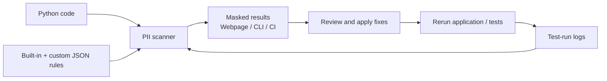

# logVeil

logVeil scans code and logs for sensitive data, traces leaks to source lines where available, applies masking fixes, and provides a local web interface to review results, manage custom detection rules, and verify clean reruns.

A dependency-free Python CLI for the **PII Log Leak Detector** use case, with code scanning, runtime log detection, masked reports, and CI baseline support.

Requires Python 3.10+. Run commands from this checkout; no installation or API key is required.

The solution is named **logVeil**; its Python module and CLI commands currently use `pii_guard` and `pii-guard`, and custom rules use the `PII_GUARD_RULES` environment variable.

## Background

Developers in the financial industry work with confidential customer information, including identity numbers, bank account details, payment card numbers, and contact information. Protecting this data is essential throughout development, testing, and production—including in application logs.

Routine debugging can accidentally expose sensitive information through a logged customer object, request payload, or exception message. These leaks can be difficult to spot during code review, particularly when the data reaches a logging statement indirectly.

Developers need a tool that is simple enough to use regularly and convenient enough to fit into their existing workflow. logVeil brings scanning, masked evidence, source locations, and masking fixes into a lightweight CLI with a local web interface. Custom detection rules let teams cover their own data formats, while rerun verification and CI checks help catch leaks early and keep confidentiality checks part of everyday development.

## Quick start: view results on localhost

```sh
# Generate the demo report, including findings before and after masking
python3 -m pii_guard demo --html scan-results.html

# Host the report locally
python3 -m pii_guard serve scan-results.html
```

Open **[http://localhost:8000/](http://localhost:8000/)** while the server is running. The CLI also prints this clickable link. The page shows masked evidence, source lines, suggested fixes, search/filter controls, and the demo's **7 → 0** comparison.

Press **Ctrl+C** to stop the server. To use another port:

```sh
python3 -m pii_guard serve scan-results.html --port 8080
```

Then open [http://localhost:8080/](http://localhost:8080/). The server displays the existing report; it does not run scans or apply fixes from the browser. Regenerate the HTML in another terminal and refresh the page to see new results.

## Architecture



The scanner checks code for risky logging calls and logs for email, IC, card, account and configured custom patterns. Structured logs identify the source file and line. Repairs use the same detection rules to mask supported logging calls before a fresh run verifies the result. IBM Bob can run and review this local workflow; no Bob API is required.

## Results webpage

Generate a standalone webpage with the demo's before/after results:

```sh
python3 -m pii_guard demo --html scan-results.html
```

Click the `Open report: file:///.../scan-results.html` link printed by the CLI (Cmd-click or Ctrl-click, depending on your terminal), or open `scan-results.html` in your browser. With `--json`, the link goes to stderr so stdout remains valid JSON. The page shows finding counts, detected data types, masked evidence, source locations, expandable traces and suggested fixes. Search and filter by type or evidence. The demo includes a before/after comparison; its temporary source paths are reference locations, not links to retained files.

To open the report through a localhost link:

```sh
python3 -m pii_guard serve scan-results.html
# Open report: http://localhost:8000/
```

Keep this command running while viewing the page; press Ctrl+C to stop. Use `--port 8080` if port 8000 is occupied. The server binds only to loopback, serves the selected report, and provides a custom-rules editor. Regenerate the report in another terminal and refresh the browser to see updates.

For your own code and captured logs:

```sh
python3 -m pii_guard scan examples/bank_service.py --logs test-run.jsonl --html scan-results.html
```

The report works offline with no server or external assets. Generate it again to refresh the results. Scan exit codes remain unchanged, including exit 1 when findings are reported. With `--baseline`, the page shows only new findings and the suppressed count.

## One-command demo

```sh
python3 -m pii_guard demo
```

The demo copies a synthetic bank service into a temporary directory, executes it, scans the logs, applies repairs to the copy, executes it again, and compares the service results. Your example source stays available for another demonstration. Temporary logs are removed on exit.

Expected result:

```text
Leaking statements: 3 → 0
Detected PII values: 7 → 0
Service results unchanged: True
```

The three planted paths are:

| Scenario | Flow | Observed data |
| --- | --- | --- |
| Direct field | Customer.email → logger.info → log | Email |
| Whole object | Customer → dataclass representation → logger.info → log | Email, Malaysian IC, card, account |
| Exception text | Customer fields → ValueError → logger.error → log | Email, account |

Reports distinguish **static heuristic risks** from **observed runtime patterns**. Multiple PII values can originate from one logging statement.

## Scan, fix, verify

```sh
# Static scan (exit 1 is expected while risks exist)
python3 -m pii_guard scan examples/bank_service.py

# Capture an example run and trace observed leaks to source locations
mkdir -p .demo
PYTHONPATH=. python3 examples/bank_service.py .demo/before.jsonl
python3 -m pii_guard scan --logs .demo/before.jsonl
python3 -m pii_guard scan examples/bank_service.py --logs .demo/before.jsonl --json

# Preview a masked diff; applying modifies this file, so use a copy for repeat demos
cp examples/bank_service.py .demo/bank_service.py
python3 -m pii_guard fix .demo/bank_service.py
python3 -m pii_guard fix .demo/bank_service.py --apply
PYTHONPATH=. python3 .demo/bank_service.py .demo/after.jsonl
python3 -m pii_guard scan .demo/bank_service.py --logs .demo/after.jsonl
```

Repairs wrap supported logging calls with `pii_guard.runtime.safe_log`. The wrapper formats interpolated fields, objects and exceptions, masks recognized values, then emits the message. It preserves logging source locations through `stacklevel`. The generated call uses an inline import to avoid changing future imports, docstrings, or existing bindings. Keep `pii_guard` importable in the repaired application's environment. For a maintained application, you can replace the generated inline import with a normal `from pii_guard.runtime import safe_log` import.

`fix` previews by default and applies only with `--apply`. Diffs are redacted for display and therefore are **not patch files**. It wraps all supported calls in the selected files, including constant messages, and is idempotent.

## Trace actual test-run logs

Attach the included formatter to a Python logging handler used by your tests:

```python
import logging
from pii_guard.runtime import JsonFormatter

handler = logging.FileHandler("test-run.jsonl", mode="w", encoding="utf-8")
handler.setFormatter(JsonFormatter())
logging.getLogger().addHandler(handler)
logging.getLogger().setLevel(logging.INFO)
```

Then run your tests and scan `test-run.jsonl`. Each JSON line contains `source`, `line`, `level`, and `message`; traceback text stays within the record. The scanner also accepts plain text logs, but reports **source unknown** when source metadata is absent. Structured nested fields are scanned too. Source locations are taken from log metadata, not independently authenticated. Use logs from the matching code revision.

The path explanation is an observed logging-call-to-log link. It is not a whole-program data-flow proof, and arbitrary plain logs cannot reliably be traced back to code.

## CI: block newly observed findings

```sh
# Deliberately record accepted findings; still exits 1 if findings exist
python3 -m pii_guard scan examples --logs test-run.jsonl --write-baseline baseline.json

# Subsequent CI runs only fail on findings absent from the baseline
python3 -m pii_guard scan examples --logs test-run.jsonl --baseline baseline.json --json
```

Exit codes: **0** no unbaselined findings, **1** findings, **2** invalid/unreadable input. Baselines contain location/type fingerprints, never payloads or payload-derived hashes. Fingerprints depend on path, line, origin and type: use stable paths in CI. Moving a line is a new finding; another value of the same type at an accepted location is suppressed. Review accepted locations accordingly.

## Add your own detection patterns

Detectors use an extensible rule registry. Add a JSON configuration to detect organisation-specific IDs, tokens, or other formats **without editing Python code**. Custom rules extend the built-in rules; the same registry powers code-literal checks, log scanning, report masking, and `safe_log` repairs. New rule names appear automatically in webpage filters and CI fingerprints.

Start with [rules/custom.json](rules/custom.json), which includes employee IDs, patient IDs and contextual API tokens:

```json
{
  "version": 1,
  "rules": [
    {
      "kind": "EMPLOYEE_ID",
      "pattern": "\\bEMP-[0-9]{6}\\b"
    },
    {
      "kind": "API_TOKEN",
      "pattern": "(?i)\\bapi_token\\s*[:=]\\s*(?P<secret>[A-Za-z0-9_-]{16,})",
      "group": "secret"
    }
  ]
}
```

For example, `EMP-123456` becomes `[EMPLOYEE_ID REDACTED]`, and `api_token=abcdefghijklmnop` becomes `api_token=[API_TOKEN REDACTED]`.

| Field | Purpose | Default |
| --- | --- | --- |
| `kind` | Unique uppercase identifier, e.g. `EMPLOYEE_ID`; cannot replace a built-in name | Required |
| `pattern` | Python regular expression; escape backslashes in JSON, use `(?i)` for case-insensitive matching | Required |
| `group` | Named capture containing only the sensitive value; surrounding context stays intact | Entire match |
| `keep_last` | Number of trailing characters to retain, from 0 to 4; shorter values are fully masked | `0` (fully redact) |
| `priority` | Higher values win when matches overlap; equal priorities follow registration order | `200` |
| `validator` | Optional `"luhn"` checksum validator for numeric patterns | None |

Built-in account rules have priority 200; other built-ins have priority 100. Built-ins are registered before custom rules. Use a higher priority for a specific rule that needs to take precedence. Overlapping lower-priority matches are skipped, so test overlaps carefully and prefer contextual patterns. Avoid matching redaction markers themselves.

### Edit rules in your browser

```sh
python3 -m pii_guard serve scan-results.html --rules rules/custom.json
```

Open **[http://localhost:8000/rules](http://localhost:8000/rules)** or click **Edit custom detection rules** above the served report. Restart an already-running server to load this new feature.

1. Add a rule using the name, regex, capture group and masking fields, or edit/remove entries in the JSON draft.
2. Click **Validate draft** to check the configuration without writing it.
3. Click **Save rules** to validate and atomically update the configured JSON file.
4. Rerun your scan with `--rules rules/custom.json --html scan-results.html`, then refresh the results page.

The editor defaults to `rules/custom.json`; `serve --rules PATH` chooses another existing file. Browser saves require a local session token and reject stale drafts if another editor has saved changes. The browser does not run scans or apply code repairs. Running applications that cache environment rules need to restart after a rule change.

### Scan using custom rules

```sh
python3 -m pii_guard scan examples --logs test-run.jsonl --rules rules/custom.json --html scan-results.html
python3 -m pii_guard serve scan-results.html
```

`--rules` is supported by `scan`, `fix`, and `demo`. Invalid regexes, duplicate names, missing capture groups and unknown configuration fields fail with exit code 2 rather than silently skipping a rule. Reports never include the regex configuration or original matched values.

### Use the same rules when running repaired code

For a complete scan → fix → rerun workflow, set the configuration for both the CLI and the application:

```sh
export PII_GUARD_RULES="$PWD/rules/custom.json"
python3 -m pii_guard scan your_service.py --logs test-run.jsonl
python3 -m pii_guard fix your_service.py
python3 -m pii_guard fix your_service.py --apply
# Run your application/tests again with this environment variable still set
python3 -m pii_guard scan your_service.py --logs fresh-test-run.jsonl --html scan-results.html
```

Replace the example paths with your project paths. An explicit `--rules` overrides the environment for that CLI invocation only. **Repairs do not embed the configuration:** a separately launched application must have `PII_GUARD_RULES` set to use custom masking rules; otherwise it uses only the built-ins. The runtime compiles and caches environment rules per process; restart the application after changing its rule file.

When adding a pattern, test a matching example, a harmless near-match, its redacted output, and a fresh application run. Keep rule files in version control. Treat regexes as trusted developer configuration: Python regex matching has no timeout here, so expensive patterns can slow scanning. This extension adds pattern coverage; it does not provide distributed scanning or whole-program tracing.

## Detection scope

- Email format candidates; email evidence is fully removed from reports.
- Malaysian IC formats: 12 digits or `######-##-####` (format only, not identity/date validation).
- Card candidates: 13–19 digits with optional spaces/hyphens, checked with Luhn.
- Account numbers: 8–18 digits following `account`, `account_number`, `account_no`, or `acct` with `:`/`=` context.
- Numeric evidence retains only its final four digits.

Static scanning uses Python AST and recognizes `logger`, `logging`, and `log` calls with standard named severity methods. It does not resolve aliases, custom loggers, `print`, `logger.log`, or interprocedural flows. Dynamic values can be harmless, so static findings require review. The fixer supports the same calls. Masking covers message text, formatted exception text and requested stack text; custom structured `extra` fields require separate field-level masking. The runtime scanner can flag these fields if they are included in your captured JSON records.

These patterns are a bounded demo, not proof that a program is free of sensitive data: names, addresses, other national IDs, encodings and unlabelled account numbers may be missed. A clean rerun means the exercised logs contain no matches for the configured detectors. Original captured logs still contain their original data; only reports and repaired future messages are masked.

## IBM Bob demo workflow

Open this project in IBM Bob, run the demo in its terminal, inspect the reported example lines, and review the generated masking diff. Apply repairs, run the service/tests again, and show the clean report. This repository provides a deterministic repair engine and does not call or require an IBM Bob API.

## Tests

```sh
python3 -m unittest discover -s tests -v
```

Tests cover detector boundaries, masked output, source tracing, object/exception leaks, traceback redaction, logging mapping arguments, Unicode source edits, idempotent repairs, nested log fields, baseline gating, and before/after service behavior.
